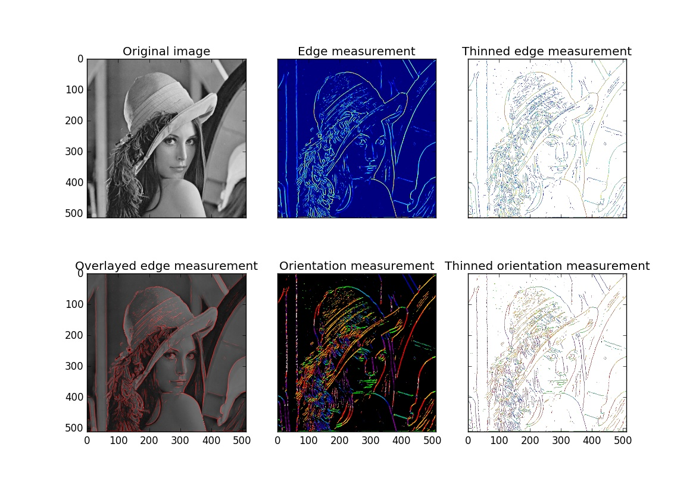

# PyCoShREM

Python port of the Matlab Toolbox [Complex Shearlet-Based Ridge and Edge Measurement](http://www.math.uni-bremen.de/~reisenho/#Software) by Rafael Reisenhofer.


## Easy Installation

You should be able to directly install PyCoShREM via pip with
```
$ sudo pip install pycoshrem
```

## Manual Installation

If you are not able to install via pip (see: [setuptools](https://pypi.python.org/pypi/setuptools)), pull this repository and make sure the neccessary dependecies are installed.

### Dependencies
The implementation relies heavily on `numpy` and `scipy`, make sure these are installed.

The thinning-algorithm used is from `scikit-kimage`.

To install the packages system-wide, run
```
$ sudo pip install numpy scipy scikit-image pillow
```
To install for a single user only, run
```
$ pip install --user numpy scipy scikit-image pillow
```
Since these packages use C-Extensions, on some Distributions (e.g. Debian) you will also need the `python-dev` packages, notably `Python.h`-Headers installed.


## Example

Several example scripts are included `examples` folder within the repository, which performs edge and ridge detection on the different kind of image data.





## Documentation
Documentation is almost non-existing at the moment, but more will be added in the future.

All stand-alone documentation can be found in the ``docs`` folder.
Sphinx with the `napoleon` extension is used to create the documentation from Google-Style docstrings.

# Build Documentation
Make sure Sphinx is installed

    $ sudo pip install Sphinx

To build the documentation using sphinx change to the docs folder and use the provided `Makefile`, e.g.:

    $ cd docs
    $ make html

This will create a html-Documentation in `docs/_build/html/`.


## Tests
Test coverage is very low at the moment.
Tests are provided via the Python unittest module and can be run from the projects root directory via

    $ python -m unittest


## Acknowledgements

Most code in this package is directly ported from the Complex Shearlet-Based Ridge and Edge Measure Toolbox (CoShREM).
However some parts of CoShREM were taken from other projects:

The method
 * `coshrem.shearlet.yapuls`

is originally taken from [Yet Another Wavelet Toolbox (YAWTb)](http://sites.uclouvain.be/ispgroup/yawtb/).

The methods

 * `coshrem.shearlet.shear` and
 * `coshrem.shearlet.padarray`

are originally taken from [ShearLab 3D](http://www.shearlab.org/).

The flame front data images
 * `K05_CH_full.txt`
 * `K05_OH_full.txt`

and the mock image
 * `B0.png`

used in tests and examples were kindly provided by Johannes Kiefer.

## License

