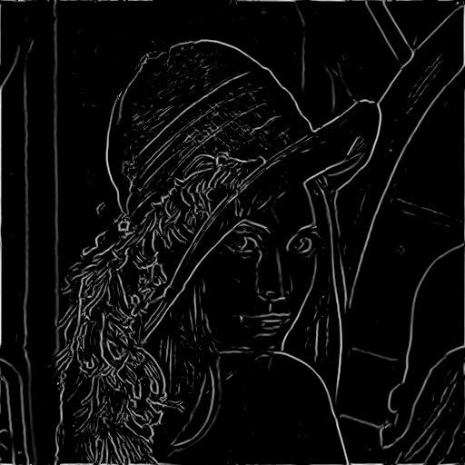
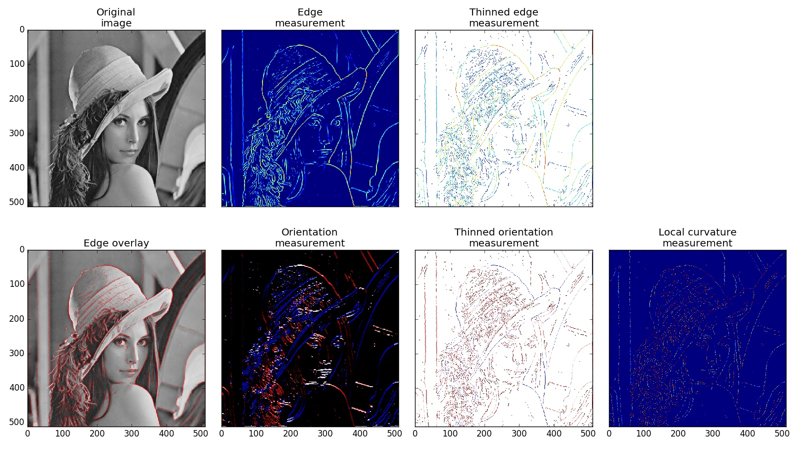

Edge Detection Example
======================

The following example script will perform Edge detection on the lena picture.

Original image
--------------
.. image:: img/lena.jpg
   :alt: Original image

Edges
-----

Edge Overlay
------------

Diagram
-------

Script
------
.. literalinclude:: ../../examples/edge_detection.py