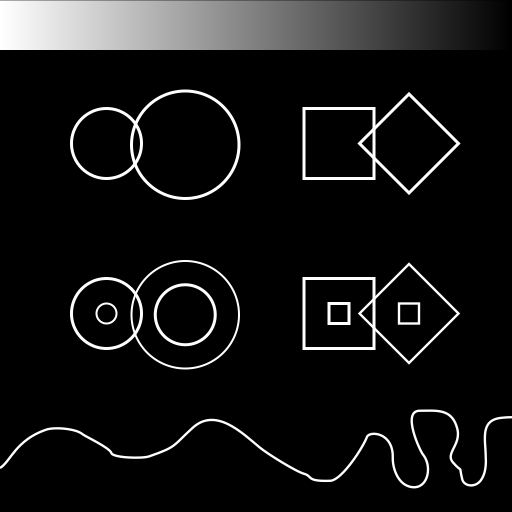
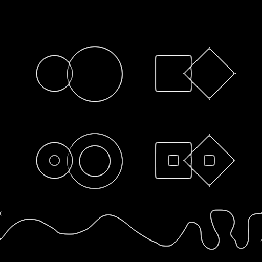
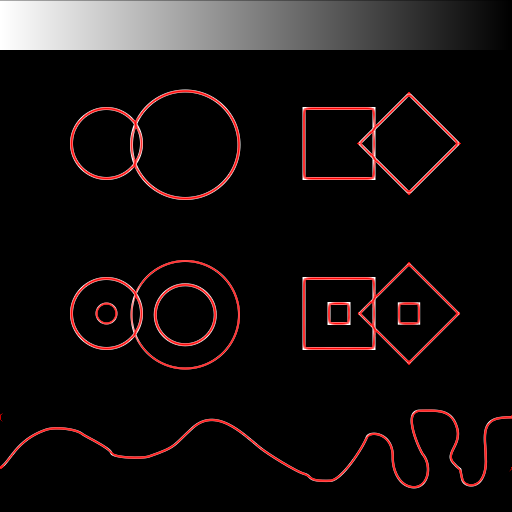
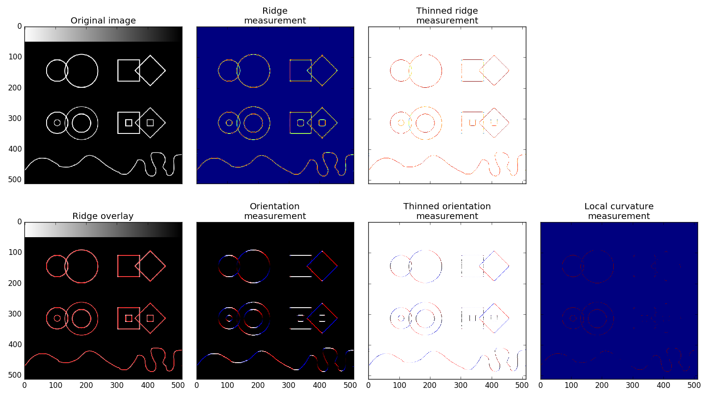

Ridge Detection Example
=======================
The following example script will perform an Edge detection on the provided mock image.

Original image
--------------

Ridge Measurement
-----------------

Ridge overlay
-------------

Diagram
-------

Script
------
.. literalinclude:: ../../examples/ridge_detection.py